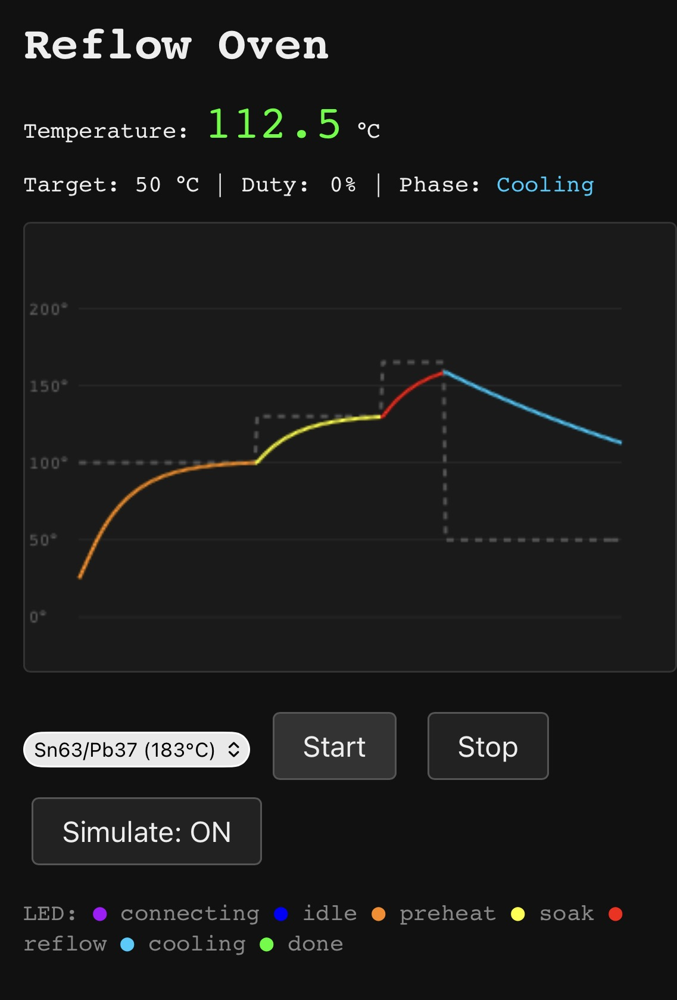

# Reflow Oven

Toaster oven conversion to a reflow soldering oven with a custom controller PCB.

## Goals

- Reliable lead-free reflow profiles (peak ~245°C)
- Thermocouple-based closed-loop temperature control
- Programmable profiles (preheat → soak → reflow → cooling)
- Safe operation (over-temperature protection, door interlock)

## Architecture

```
MAINS → [Emergency Stop] → [Electronics Box] → [Oven]
                                  │
                            ┌─────┴─────┐
                            │ SSR       │──── switches Live to oven elements
                            │ ESP32-S3  │──── WiFi web UI, PID control
                            │ NTC divider│──── thermistor into oven chamber
                            └───────────┘
```

## Components

| Component | Part | Role |
|-----------|------|------|
| Toaster oven | Severin TO-2052 (9L, 800W) | Heating chamber |
| Controller | ESP32-S3-DevKitC-1 | Profile management, PID control, WiFi web UI |
| SSR | Solid-state relay (available) | Switches mains to heating elements |
| Temperature sensor | NTC 100K B3950 (DollaTek, glass-sealed) | Temperature sensing inside chamber |
| Emergency stop | Mushroom-head switch | Mains kill switch |
| Enclosure | Abzweigdose ~120×80mm | Houses ESP32 + SSR |
| Solder paste | Relife HW21 Sn63/Pb37 (183°C) | Primary paste |
| Solder paste | Sn42/Bi58 low-temp (138°C) | Alternative for heat-sensitive components |

## Wiring

```
MAINS (230V) ─── [Emergency Stop] ─── Kabelverschraubung into box
                                              │
  Live ──────────────── SSR input ─── SSR output ──── Oven element (hot)
  Neutral ─────────────────────────────────────────── Oven element (neutral)
  Earth ───────────────────────────────────────────── Oven chassis

  SSR control (+) ──── ESP32 GPIO5
  SSR control (-) ──── ESP32 GND

  ESP32 3.3V ─── 100K resistor ──┬── NTC thermistor ─── ESP32 GND
                                  │
                             ESP32 GPIO4 (ADC)

  ESP32 powered via USB (separate charger)
  Thermistor wires through Kabelverschraubung into oven chamber
```

## Oven Modifications

1. Bypass (short) the built-in thermostat
2. Drill ~4mm hole for thermistor wire, seal with Kapton tape

## Firmware

Rust (esp-rs) firmware for ESP32-S3-DevKitC in `firmware/`.

### Modules

| File | Purpose |
|------|---------|
| `sensor.rs` | `TemperatureSensor` trait + NTC 100K B3950 thermistor (ADC) |
| `pid.rs` | PID controller (output 0–100%) |
| `profile.rs` | Reflow profile state machine (Preheat→Soak→Reflow→Cooling) |
| `ssr.rs` | Slow PWM driver for solid-state relay |
| `web.rs` | HTTP server with live dashboard + JSON API |
| `main.rs` | WiFi, control loop (4 Hz), wires everything together |

### Wiring

```
GPIO4 (ADC) ──┬── NTC 100K ── GND
              └── 100K resistor ── 3.3V

GPIO5        ── SSR input (+)
GND          ── SSR input (-)
```

### Build & Flash

```sh
# Prerequisites: mise (https://mise.jdx.dev)
make setup

# Build and flash (WiFi secrets sourced from ../home-assistant-config/esphome/secrets.sops.yaml):
make flash
```

### Web UI

Once running, open `http://reflow-oven.home/` in a browser. Endpoints:



- `GET /` — dashboard with live temperature chart
- `GET /status` — JSON: `{temperature, target, duty_pct, phase, simulating, elapsed_s}`
- `GET /history` — JSON array of `{t, temp, target, phase}` points
- `POST /start` — begin reflow profile
- `POST /stop` — abort
- `POST /simulate` — toggle simulated sensor
- `POST /profile` — set profile (`sn63pb37` or `sn42bi58`)

## Status

🚧 **Prototype** — firmware scaffolded, hardware assembly pending.

## Open Questions

- [x] Which toaster oven? → Severin TO-2052 (9L, 800W, fits Granit 92×99.5mm and pedalboard 179×112mm)
- [ ] PID tuning for chosen oven
- [ ] Over-temperature safety cutoff (software watchdog)

## Related

- [Granit project](https://github.com/laenzlinger/granit) — the PCB this oven will reflow
- [df40c-jig](https://github.com/laenzlinger/df40c-jig) — alignment jig used during assembly

## License

[CERN Open Hardware Licence Version 2 - Permissive](https://ohwr.org/cern_ohl_p_v2.txt)
